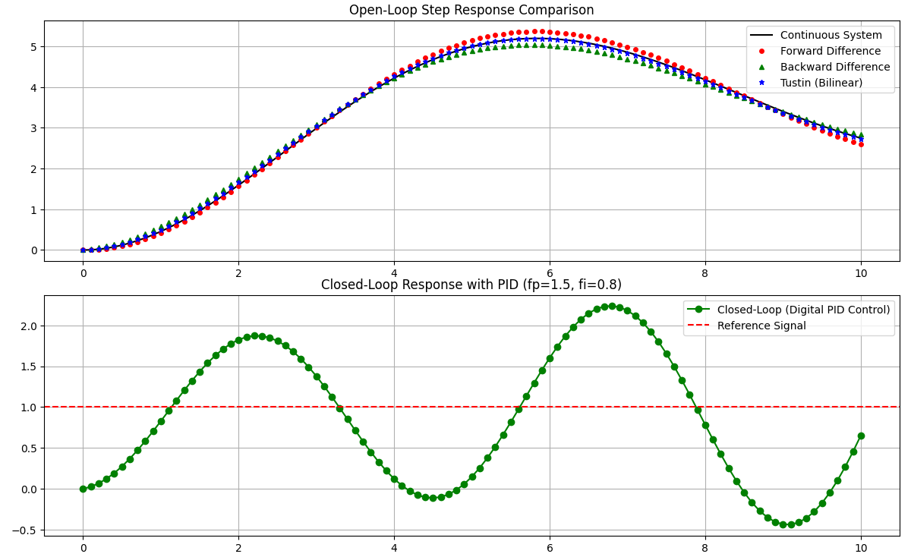

# Digital Control Systems: Discretization & PID Control

This repository contains Python implementations for discretizing continuous-time control systems and executing closed-loop digital control simulations. It demonstrates algorithmic translations into the Z-domain and exact state-space discretization for aerospace models.

## 🚀 Features

* **Transfer Function Discretization:** Algorithmic implementation of fundamental numerical methods derived from theoretical control notes:
  * [cite_start]**Forward Difference (Euler):** [cite: 5, 6, 7]
  * [cite_start]**Backward Difference:** Stable approximation using previous state values[cite: 15, 16, 23].
  * [cite_start]**Tustin (Bilinear Transform):** High-accuracy mapping using Symbolic Mathematics to handle polynomial expansion[cite: 33, 39, 41].
* **Digital PID Controller:** Object-oriented implementation featuring proportional ($f_p$) and integral ($f_i$) gains.
* [cite_start]**State-Space Exact Discretization:** Computation of $A_d = e^{AT}$ and $B_d$ applied to an **F-4E Aircraft** model[cite: 57, 59, 64].

## 🛠️ Technologies & Libraries

* **Python 3.x**
* **NumPy & SciPy:** For matrix operations and LTI system simulation.
* **SymPy:** For symbolic polynomial expansion.
* **Matplotlib:** For engineering-grade data visualization.

## 📊 Results & Visualization

The simulation generates a dual-plot visualization. The top plot compares open-loop discrete methods with the continuous system, while the bottom plot demonstrates the setpoint tracking of the digital PID controller.

## 💻 How to Run

1. Clone the repository:  git clone [https://github.com/Serts1/discretization_methods.git](https://github.com/Serts1/discretization_methods.git)
2. Install dependencies:  pip install numpy scipy sympy matplotlib
3. Execute the simulation: python discretization_methods.py

🧠 Project Background
This project bridges classical control theory with modern software engineering practices, developed as part of a Master’s in Robotics and Industrial Control.

1. Aircraft Model: The state-space analysis uses the pitch-axis dynamics of an F-4E Phantom II aircraft.
2. Control Tuning: The digital PID parameters ($f_p, f_i$) are implemented to showcase discrete-time stability and precise setpoint tracking.
3. Algorithmic Focus: Rather than using built-in conversion functions, the discretization logic is implemented from first principles using factorials and binomial expansions.

This project is licensed under the MIT License - see the LICENSE file for details.

Serafeim Tsivleris : https://github.com/Serts1
